<p align="center">
  
</p>

<h1 align="center">LumenOps 360 — Manufacturing Operations Intelligence</h1>

<p align="center">
  <strong>An end-to-end operations analytics solution for a mid-size LED lighting manufacturer,<br/>built to quantify where time, material, and money are lost on the shop floor.</strong>
</p>

<p align="center">
  
  
  
  
  
</p>

<p align="center">
  <a href="https://app.powerbi.com/view?r=eyJrIjoiODcwMWMyM2UtZmJlZC00Y2ZmLTgyNjEtOGJhODFiYmJiMzk3IiwidCI6ImM2ZTU0OWIzLTVmNDUtNDAzMi1hYWU5LWQ0MjQ0ZGM1YjJjNCJ9">🔗 Live Dashboard</a> · <a href="docs/methodology.md">📘 Methodology</a> · <a href="docs/kpi_definitions.md">📊 KPI Definitions</a> · <a href="docs/case_study_5_whys.md">🔍 5 Whys Case Study</a>
</p>

---

> *Every insight is quantified in euros — the language of plant directors and operations leaders.*

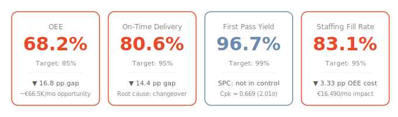

---

## The Business Problem

LumenTech BV is a fictional Dutch OEM LED manufacturer based in Eindhoven, supplying private-label fixtures to retailers like Gamma, Hornbach, Praxis, and Action. The plant runs three assembly lines across two shifts — and the operations team is firefighting daily:

- Customer orders are chronically overdue — On-Time Delivery sits at **80.6%** against a 95% target
- OEE is **68.2%**, well below the 85% world-class benchmark — driven by changeovers, understaffing, and schedule volatility
- Quality escapes go untracked — First Pass Yield is **96.7%**, with Outdoor products consistently worse
- Shifts run below planned staffing (**83.1% fill rate**) and nobody has quantified the cost
- Monthly reviews rely on disconnected Excel exports with no unified operational view

These are not hypothetical problems. They map directly to pain points that **Signify** (ex-Philips Lighting) disclosed in its 2024 Annual Report and Q4 earnings call: Order & Delivery NPS dips, a €200M+ operational efficiency program, 5,160 FTE reductions amid the tightest labor market in Dutch history (97 vacancies per 100 unemployed), and supply chain fragility that pushed 3% of quarterly sales into the next quarter.

**This project models those exact problems at plant scale and quantifies the improvement opportunity: ~€66,500/month (~€798K/year).**

---

## Dashboard — Six Pages of Operational Intelligence

<p align="center">
  <a href="https://app.powerbi.com/view?r=eyJrIjoiODcwMWMyM2UtZmJlZC00Y2ZmLTgyNjEtOGJhODFiYmJiMzk3IiwidCI6ImM2ZTU0OWIzLTVmNDUtNDAzMi1hYWU5LWQ0MjQ0ZGM1YjJjNCJ9"><strong>▶ Open Live Dashboard</strong></a>
</p>

### Page 1 — Executive Overview
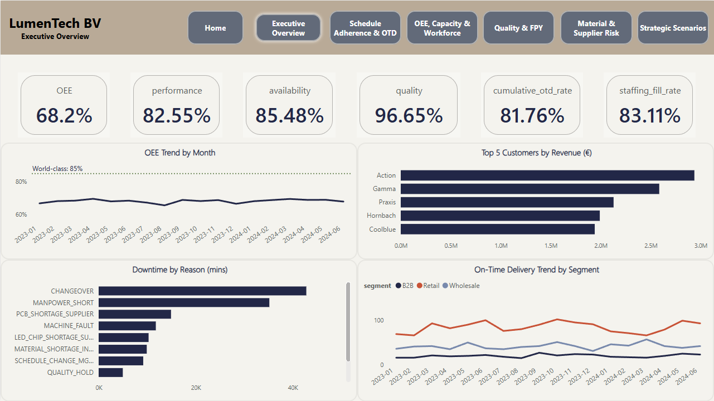
KPI cards, OEE trend with 85% world-class benchmark, OTD by customer segment, and downtime vs. production split. The plant director's weekly pulse check.

### Page 2 — Schedule Adherence & On-Time Delivery
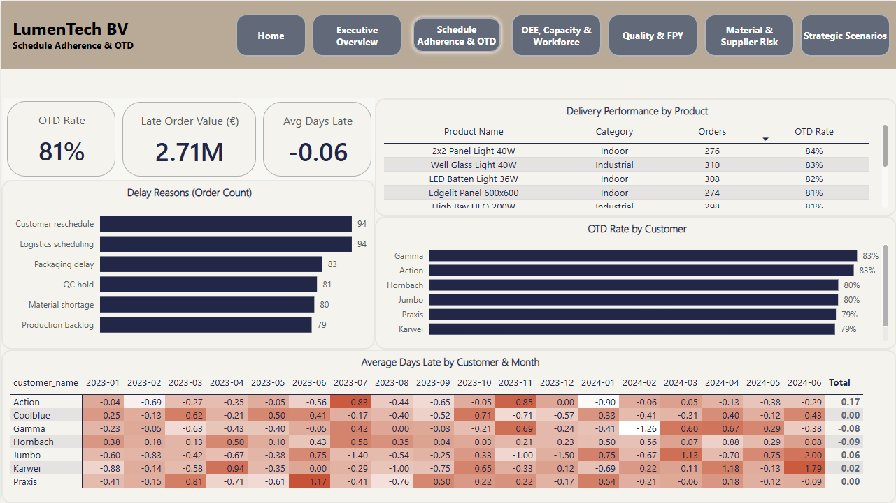
OTD funnel from order intake through dispatch, overdue orders heatmap, and delay-reason Pareto. Reveals that production scheduling — not logistics — is the dominant bottleneck.

### Page 3 — OEE, Capacity & Workforce Impact
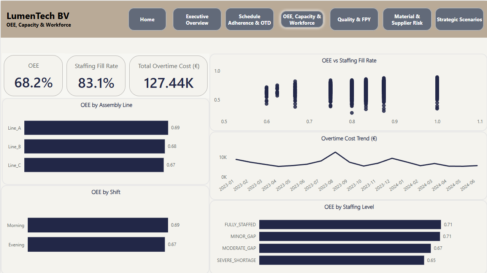
OEE decomposition (Availability × Performance × Quality), Six Big Losses in euros, line-wise bottleneck identification, and the staffing-OEE correlation that quantifies the Dutch labor shortage at plant level.

### Page 4 — Quality & First Pass Yield
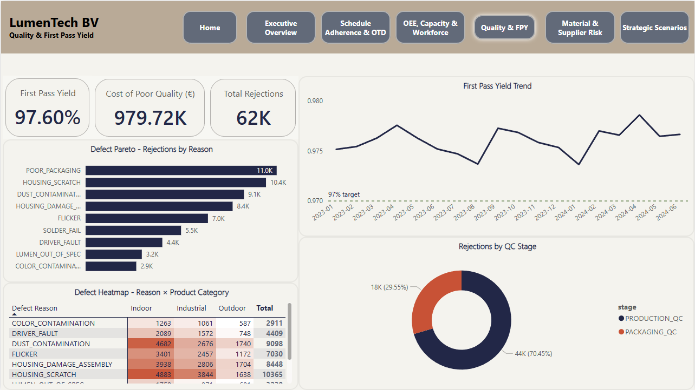
Defect Pareto, stage-wise rejection split (Production QC vs. Packaging QC), COPQ breakdown in euros, and SPC control chart integration. The process is NOT in statistical control — 73 out-of-control days detected.

### Page 5 — Material & Supplier Risk
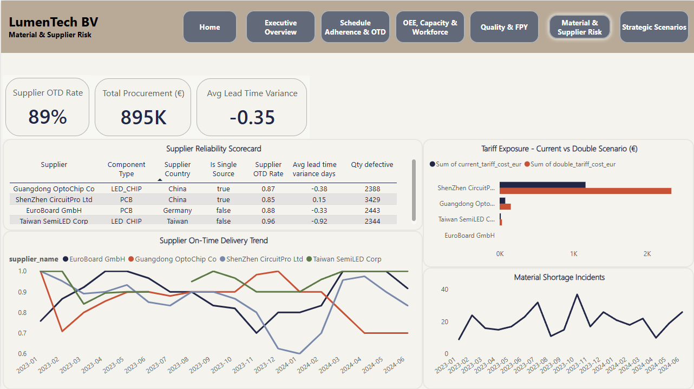
Supplier reliability scorecard, single-source dependency mapping, lead time variance analysis, and supply disruption scenario modeling. Mirrors the supply chain fragility Signify's CEO publicly cited.

### Page 6 — Strategic Scenarios
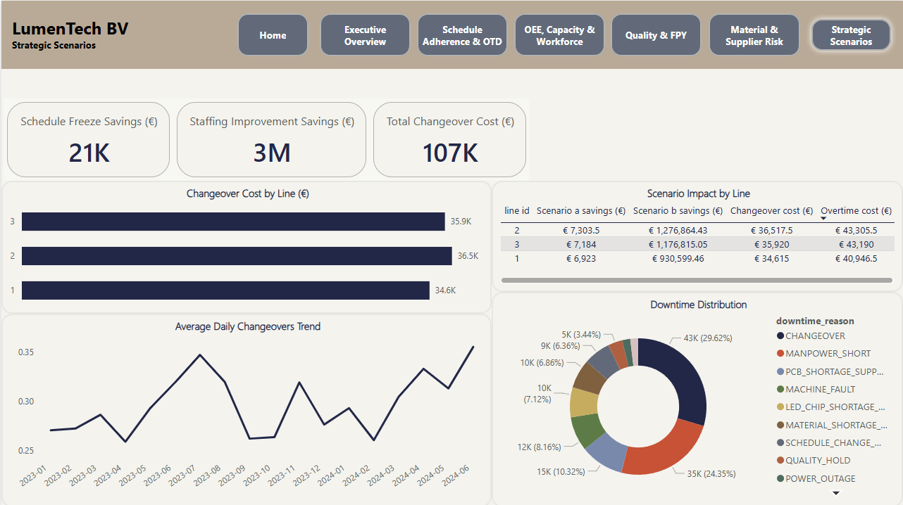
Schedule volatility cost, changeover hours analysis, and three improvement scenarios: schedule freeze, staffing optimization, and line consolidation — each quantified in monthly euros.

---

## Statistical Evidence — Three Jupyter Notebooks

### Notebook 1 — Exploratory Data Analysis (38 cells)

Full data profiling across all tables, downtime Pareto analysis, staffing correlation discovery, and KPI baseline validation.

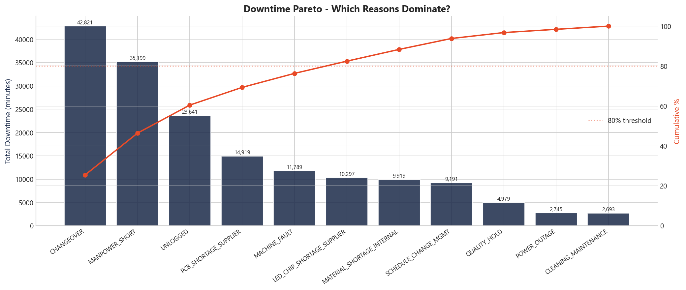

CHANGEOVER dominates at 42,821 minutes — confirming it as the #1 capacity loss driver. MANPOWER_SHORT follows at 35,199 minutes, reflecting the Dutch labor shortage.

<details>
<summary><strong>More EDA visualizations</strong></summary>
<br/>

**OEE by assembly line — identifying the constraint:**
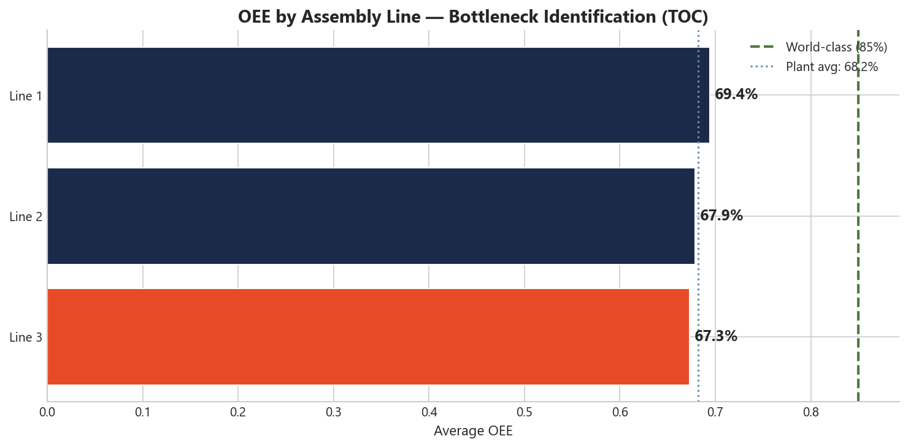

**Staffing fill rate vs. OEE — quantifying the labor shortage cost:**
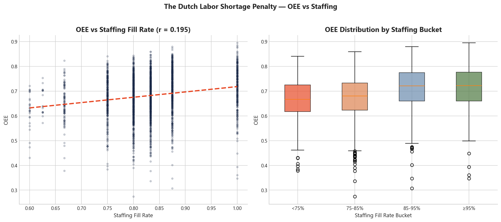

**OEE monthly trend — 18 months of operational performance:**
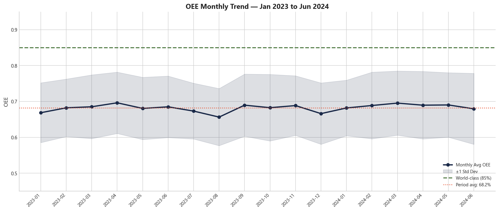

**Defect Pareto — which quality failures cost the most:**
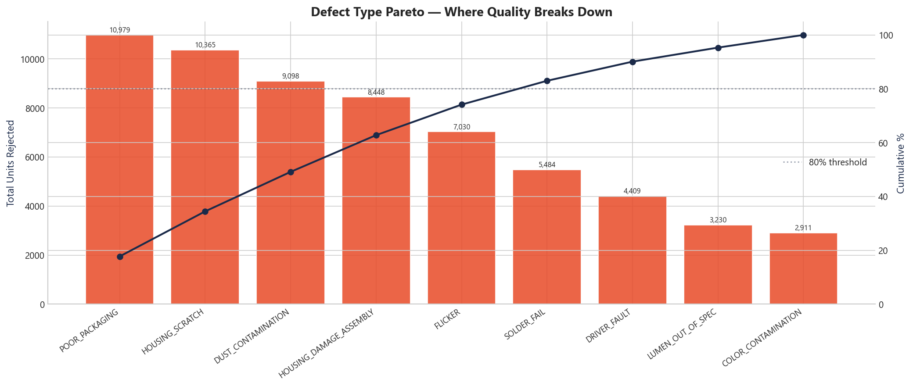

**FPY by QC stage — Production vs. Packaging:**
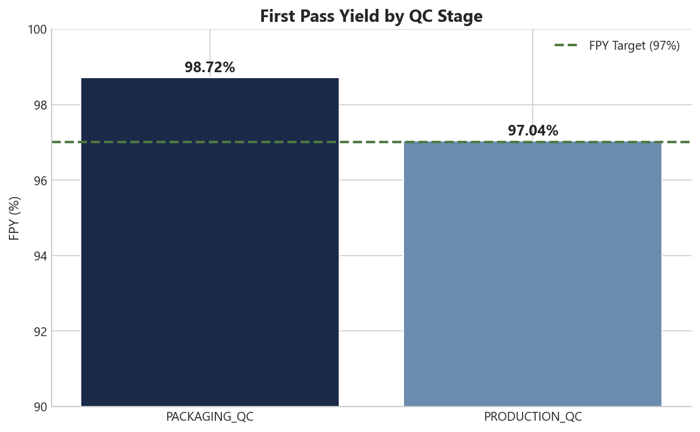

**Staffing analysis — planned vs. actual operators:**
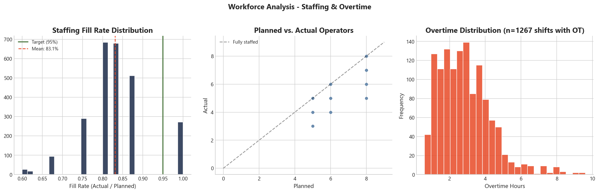

**Line × shift comparison:**
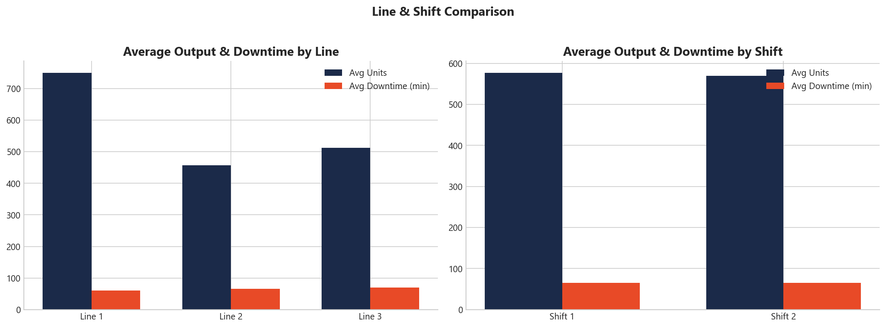

**Delivery performance:**
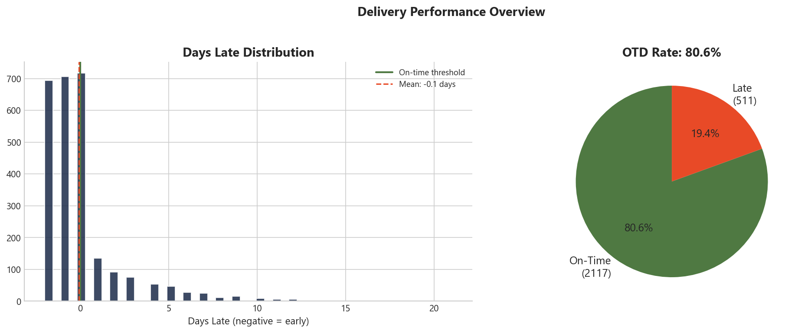

**Production distributions:**
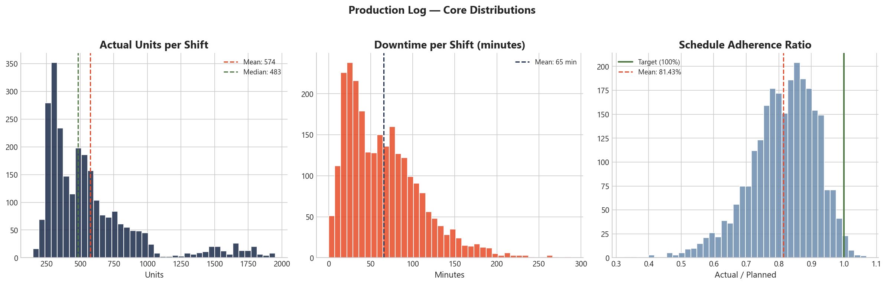

**OEE component distributions:**
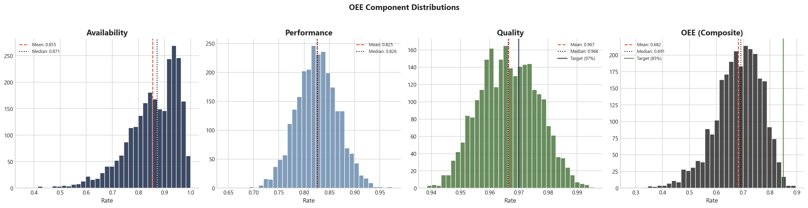

</details>

---

### Notebook 2 — SPC Control Charts (27 cells)

p-chart, X-bar/R, and I-MR charts for defect rate and OEE. Western Electric rules analysis reveals violations on **49.4% of days**. Process capability: Cpk = 0.669 (only 2.01σ).

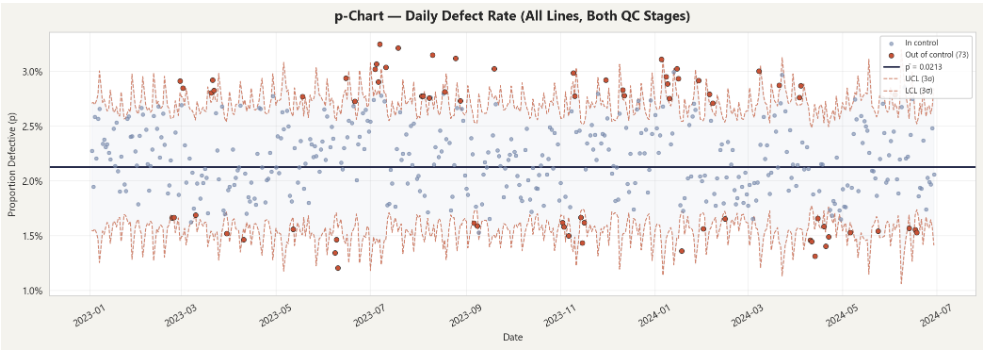

The defect rate process is **NOT in statistical control** — 73 out-of-control points detected. OEE is in control but stably centered at 68.3%, far below the 85% world-class benchmark. This distinction matters: the defect process needs stabilization, while OEE needs a level shift.

---

### Notebook 3 — Hypothesis Testing

Five hypotheses tested, all rejected at α = 0.05. Non-parametric methods used throughout (Shapiro-Wilk confirmed non-normality across all groups).

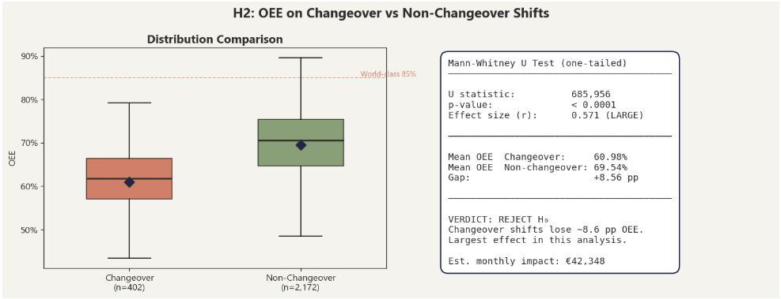

| # | Hypothesis | Test | Effect Size | Monthly € Impact |
|---|-----------|------|-------------|-----------------|
| H1 | Understaffed shifts have lower OEE | Mann-Whitney U | r = 0.231, 3.33 pp gap | €16,490 |
| H2 | Changeover shifts have lower OEE | Mann-Whitney U | r = 0.571, 8.56 pp gap | **€42,348** |
| H3 | OEE differs between assembly lines | Kruskal-Wallis | H = 33.94, Lines 2+3 joint bottleneck | — |
| H4 | Evening shift has lower OEE | Mann-Whitney U | r = 0.107, 1.55 pp gap | €7,695 |
| H5 | Outdoor products have higher defect rate | Chi-Square | χ² = 1184, Cramér's V = 0.020 | Negligible |

---

## The Improvement Opportunity — €798K/year

| Root Cause | OEE Recovery | Monthly € Impact | Statistical Method |
|------------|-------------|-------------------|--------------------|
| Schedule freeze (changeover reduction) | Up to 8.56 pp | €42,348 | Mann-Whitney U, r = 0.571 |
| Staffing fill improvement (85% → 95%) | Up to 3.33 pp | €16,490 | Mann-Whitney U, r = 0.231 |
| Evening shift protocol standardization | Up to 1.55 pp | €7,695 | Mann-Whitney U, r = 0.107 |
| **Total addressable** | **~13.4 pp** | **~€66,500/month → ~€798K/year** | |

The largest single lever is **changeover reduction** — shifts with a changeover event lose 8.56 OEE percentage points. This is a scheduling governance problem, not an equipment problem, addressable through SMED methodology and a 48-hour schedule freeze policy.

---

## Operational Management Frameworks

This project applies six established operations frameworks — each mapped to a specific deliverable, grounded in actual data findings, not listed as theory.

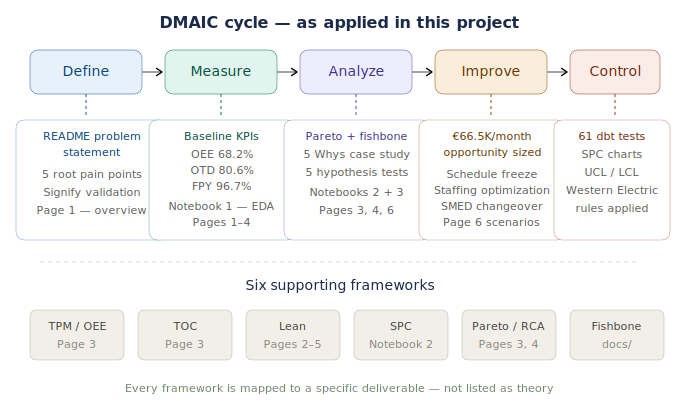

| Framework | Application | Deliverable |
|-----------|-------------|-------------|
| **Six Sigma (DMAIC)** | Entire project structure follows Define → Measure → Analyze → Improve → Control | dbt tests enforce Control phase at the data layer |
| **TPM / Six Big Losses** | OEE decomposed into Availability × Performance × Quality | Dashboard Page 3, quantified in euros |
| **Theory of Constraints** | Line-wise OEE identifies Lines 2+3 as joint constraint | Dashboard Page 3, Notebook 3 (H3) |
| **Lean (TIMWOODS)** | Eight wastes mapped: Waiting, Defects, Inventory, Over-processing | Dashboard Pages 2–5 |
| **SPC (Shewhart)** | p-chart, X-bar/R, I-MR with Western Electric rules | Notebook 2 (27 cells) |
| **Root Cause Analysis** | Pareto, Fishbone (Ishikawa), 5 Whys | Pages 3–4 + [`docs/`](docs/) folder |

Detailed documentation: [`methodology.md`](docs/methodology.md) · [`fishbone_housing_damage.md`](docs/fishbone_housing_damage.md) · [`case_study_5_whys.md`](docs/case_study_5_whys.md) · [`kpi_definitions.md`](docs/kpi_definitions.md)

---

## Industry Context — Why This Matters Now

The pain points modeled in this project reflect structural challenges facing Dutch manufacturing:

- **Labor shortage:** The Netherlands has 97 job openings per 100 unemployed (DNB 2025). This project quantifies the OEE cost of running understaffed — a 3.33 percentage point penalty worth €16,490/month
- **Operational efficiency pressure:** Signify launched a €200M+ annual cost-saving reorganization. This project identifies €798K/year in addressable improvement at plant scale
- **Supply chain fragility:** Signify's CEO disclosed that component shortages pushed 3% of quarterly revenue. This project models single-supplier dependency and lead time variance
- **Asset-light manufacturing:** Signify is consolidating from 41 plants. Dashboard Page 6 models the line consolidation scenario

Sources: Signify 2024 Annual Report, Q4 2024 Earnings Call, OECD Economic Surveys: Netherlands 2025, DNB Spring Projections 2025.

---

## Architecture

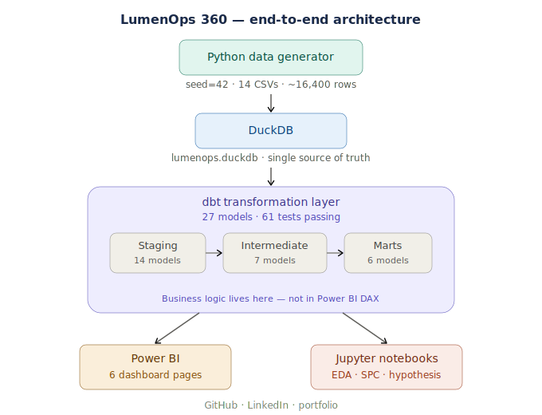

### Tech Stack

| Layer | Tool | Detail |
|-------|------|--------|
| Data Generation | Python (pandas, numpy, faker) | Seeded (42), 14 tables, 18 months of daily data (Jan 2023 – Jun 2024) |
| Storage | DuckDB | Zero-infrastructure, file-based analytical database |
| Transformation | dbt (dbt-duckdb) | 27 models across staging / intermediate / marts, 61 passing tests |
| Visualization | Power BI Desktop | 6 dashboard pages, custom JSON theme, ODBC connection to DuckDB |
| Analysis | Jupyter (scipy, statsmodels, matplotlib) | EDA, SPC control charts, hypothesis testing |

### dbt Model Architecture

```
models/
├── staging/          Raw → clean, renamed, typed (14 models)
├── intermediate/     Business logic + KPI calculations (7 models)
│   ├── int_oee_daily.sql
│   ├── int_fpy_by_batch.sql
│   ├── int_otd_by_order.sql
│   ├── int_copq_monthly.sql
│   ├── int_staffing_impact.sql
│   ├── int_supplier_reliability.sql
│   └── int_schedule_volatility.sql
└── marts/            1:1 with Power BI pages (6 models)
    ├── mart_executive_overview.sql      → Page 1
    ├── mart_schedule_adherence.sql      → Page 2
    ├── mart_oee_workforce.sql           → Page 3
    ├── mart_quality_fpy.sql             → Page 4
    ├── mart_material_supplier.sql       → Page 5
    └── mart_strategic_scenarios.sql     → Page 6
```

Business logic lives entirely in dbt — Power BI handles visualization only.

### Design System

| Role | Color | Hex |
|------|-------|-----|
| Primary | Navy | `#1B2A49` |
| Accent / Alert | Ember | `#E84A27` |
| Secondary | Steel Blue | `#6B8CAE` |
| Success | Sage | `#4F7942` |
| Background | Soft Ivory | `#F5F3EE` |
| Text | Charcoal | `#2D2D2D` |

Applied consistently across Power BI (custom JSON theme), Jupyter visualizations (matplotlib), and documentation.

---

## Repository Structure

```
LumenOps-360/
├── README.md
├── docs/
│   ├── LumenOps_360_Blueprint.md       # Project blueprint (v1.3 final)
│   ├── kpi_definitions.md              # KPI formulas + validated baselines
│   ├── methodology.md                  # DMAIC, TPM, TOC, Lean, SPC applied
│   ├── case_study_5_whys.md            # Root cause trace: OTD → changeover
│   └── fishbone_housing_damage.md      # Ishikawa analysis for Outdoor defects
├── src/
│   ├── generate_data.py                # Reproducible data generator (seed=42)
│   ├── load_to_duckdb.py               # CSV → DuckDB loader with integrity checks
│   └── config.py                       # Simulation parameters
├── lumenops/                           # dbt project root
│   ├── dbt_project.yml
│   ├── profiles.yml
│   └── models/
│       ├── staging/                    # 14 models
│       ├── intermediate/              # 7 models
│       └── marts/                     # 6 models
├── notebooks/
│   ├── 01_eda.ipynb                    # 38 cells — data profiling + baselines
│   ├── 02_spc_control_charts.ipynb     # 27 cells — p-chart, X-bar/R, I-MR
│   └── 03_hypothesis_testing.ipynb     # 5 hypotheses, all rejected at α = 0.05
├── data/
│   └── raw/                            # 14 generated CSVs
├── powerbi/
│   ├── LumenOps.pbix
│   └── LumenOps_360_Theme.json
└── assets/
    ├── architecture.svg
    ├── dmaic_framework.svg
    └── kpi_baseline_cards.svg
```

---

## How to Reproduce

```bash
# 1. Clone the repository
git clone https://github.com/HP85-NL/LumenOps-360.git
cd LumenOps-360

# 2. Install dependencies
pip install dbt-duckdb duckdb pandas numpy faker seaborn matplotlib scipy statsmodels jupyter

# 3. Generate the data (seed=42 — identical output every run)
cd src
python generate_data.py

# 4. Load into DuckDB
python load_to_duckdb.py

# 5. Run dbt transformations and tests
cd ../lumenops
dbt run --profiles-dir .
dbt test --profiles-dir .       # 61 tests, all passing

# 6. Open notebooks or Power BI
# Jupyter notebooks connect to ../data/lumenops.duckdb
# Power BI connects via DuckDB ODBC driver to the mart layer
```

---

## About the Author

**Harshil Patel** — Electronics Engineering graduate and former Production Engineer at an LED lighting manufacturer. This project draws on real shop-floor experience: the production flow, defect types (FLICKER, HOUSING_DAMAGE_ASSEMBLY, DUST_CONTAMINATION), downtime codes, and operational pain points are grounded in lived experience, not textbook theory.

This is the third project in a deliberate portfolio sequence — each progressively deeper in domain coverage and analytical sophistication:

---

<p align="center"><em>Built with Python, DuckDB, dbt, Power BI, and Jupyter.<br/>Targeting operations analyst and data analyst roles in Dutch manufacturing.</em></p>
